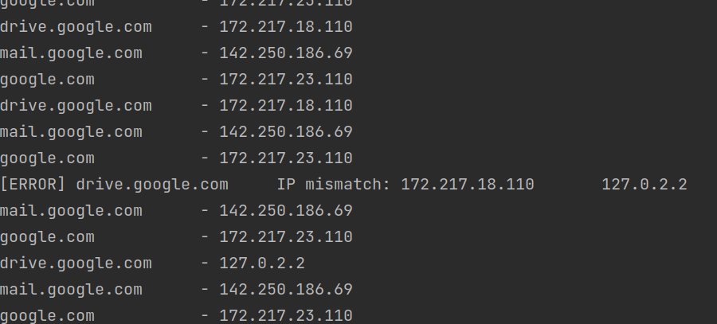

# Домашнее задание к занятию "4.2. Использование Python для решения типовых DevOps задач"

## Обязательные задания

1. #### Есть скрипт:
	```python
    #!/usr/bin/env python3
	a = 1
	b = '2'
	c = a + b
	```
	* #### Какое значение будет присвоено переменной c?
      При попытки инициализации переменной `c` произойдет ошибка `TypeError: unsupported operand type(s) for +: 'int' and 'str'`
      т.к. значения переменных `a` и `b` имеют разные типы
 	* #### Как получить для переменной c значение 12?
      Нужно привести значение `a` к типу string. Тогда при выполнении выражения `c = str(a) + b` произойдет конкатенация строк и мы получим значение `12`.
      Если же мы хотим получить 12 как int - нужно привести строку явно `c = int(str(a) + b)`
	* #### Как получить для переменной c значение 3?
      Нужно привести значение `b` к типу int. `c = a + int(b)`
1. #### Мы устроились на работу в компанию, где раньше уже был DevOps Engineer. Он написал скрипт, позволяющий узнать, какие файлы модифицированы в репозитории, относительно локальных изменений. Этим скриптом недовольно начальство, потому что в его выводе есть не все изменённые файлы, а также непонятен полный путь к директории, где они находятся. Как можно доработать скрипт ниже, чтобы он исполнял требования вашего руководителя?

	```python
    #!/usr/bin/env python3

    import os

	bash_command = ["cd ~/netology/sysadm-homeworks", "git status"]
	result_os = os.popen(' && '.join(bash_command)).read()
    is_change = False
	for result in result_os.split('\n'):
        if result.find('modified') != -1:
            prepare_result = result.replace('\tmodified:   ', '')
            print(prepare_result)
            break

	```
    ========================================================================
   ```python
    import os

    path = "/home/dzvi/project/study.netologia/netologia/"
    bash_command = [f"cd {path}", "git status"]
    result_os = os.popen(' && '.join(bash_command)).read()
    is_change = False
    for result in result_os.split('\n'):
        if result.find('modified') != -1:
            prepare_result = result.replace('\tmodified:   ', '')
            print(path + prepare_result)
    ```
   [Скрипт](task2-3.py) выходит из цикла обработки относитеьных дирректорий измененных файлов после первого нахождения файла. Уберем break и добавим определение абсолютного пути к файлу.
1. #### Доработать скрипт выше так, чтобы он мог проверять не только локальный репозиторий в текущей директории, а также умел воспринимать путь к репозиторию, который мы передаём как входной параметр. Мы точно знаем, что начальство коварное и будет проверять работу этого скрипта в директориях, которые не являются локальными репозиториями.
    ```python
    #!/usr/bin/env python3
    import os
    import argparse
    import pathlib
    
    aparser = argparse.ArgumentParser(
        description="Find modified files in repository"
    )
    # add rep_pwd argument
    aparser.add_argument("rep_pwd", help="path to repository", type=pathlib.Path)
    # parse args
    args = aparser.parse_args()
    # get abs path because in arg may be relative
    abs_path = os.path.abspath(args.rep_pwd) + '/'
    
    bash_command = [f"cd {abs_path}", "git status"]
    # cd to repository and exec git status
    result_os = os.popen(' && '.join(bash_command)).read()
   
    # if stdout is empty - exit
    if not result_os:
        print("Error - please check path to git repository")
        exit(1) 
   
    for result in result_os.split('\n'):
        # search modified files
        if result.find('modified') != -1:
            prepare_result = result.replace('\tmodified:   ', '')
            # print abs path to modified file
            print(abs_path + os.path.basename(prepare_result))
    ```
   [Скрипт](task2-3.py)
1. #### Наша команда разрабатывает несколько веб-сервисов, доступных по http. Мы точно знаем, что на их стенде нет никакой балансировки, кластеризации, за DNS прячется конкретный IP сервера, где установлен сервис. Проблема в том, что отдел, занимающийся нашей инфраструктурой очень часто меняет нам сервера, поэтому IP меняются примерно раз в неделю, при этом сервисы сохраняют за собой DNS имена. Это бы совсем никого не беспокоило, если бы несколько раз сервера не уезжали в такой сегмент сети нашей компании, который недоступен для разработчиков. Мы хотим написать скрипт, который опрашивает веб-сервисы, получает их IP, выводит информацию в стандартный вывод в виде: <URL сервиса> - <его IP>. Также, должна быть реализована возможность проверки текущего IP сервиса c его IP из предыдущей проверки. Если проверка будет провалена - оповестить об этом в стандартный вывод сообщением: [ERROR] <URL сервиса> IP mismatch: <старый IP> <Новый IP>. Будем считать, что наша разработка реализовала сервисы: drive.google.com, mail.google.com, google.com.
    ```python
    #!/usr/bin/env python3
    import socket
    import time
    
    # ste urls for checks
    urls = ('drive.google.com', 'mail.google.com', 'google.com')
    
    # map IP
    host_ips = dict()
    
    while True:
        # for each url
        for url in urls:
            # get prev ip
            prev_ip = host_ips.get(url)
            # get curr ip
            curr_ip = socket.gethostbyname(url)
            host_ips[url] = curr_ip
            # if prev ip is set and prev_ip != curr_ip
            if prev_ip and prev_ip != curr_ip:
                # print error
                print(f'[ERROR] {url:20} IP mismatch: {prev_ip} {curr_ip}')
                continue
            print(f'{url:20} - {socket.gethostbyname(url)}')
        # will do it every 5 second
        time.sleep(5)
   ```
   Запустим [cкрипт](task4.py) посмотрим вывод, пойдем в /etc/hosts подменим ip для какого-нибудь хоста. Ошибки падают  
    
## Дополнительное задание (со звездочкой*) - необязательно к выполнению

#### Так получилось, что мы очень часто вносим правки в конфигурацию своей системы прямо на сервере. Но так как вся наша команда разработки держит файлы конфигурации в github и пользуется gitflow, то нам приходится каждый раз переносить архив с нашими изменениями с сервера на наш локальный компьютер, формировать новую ветку, коммитить в неё изменения, создавать pull request (PR) и только после выполнения Merge мы наконец можем официально подтвердить, что новая конфигурация применена. Мы хотим максимально автоматизировать всю цепочку действий. Для этого нам нужно написать скрипт, который будет в директории с локальным репозиторием обращаться по API к github, создавать PR для вливания текущей выбранной ветки в master с сообщением, которое мы вписываем в первый параметр при обращении к py-файлу (сообщение не может быть пустым). При желании, можно добавить к указанному функционалу создание новой ветки, commit и push в неё изменений конфигурации. С директорией локального репозитория можно делать всё, что угодно. Также, принимаем во внимание, что Merge Conflict у нас отсутствуют и их точно не будет при push, как в свою ветку, так и при слиянии в master. Важно получить конечный результат с созданным PR, в котором применяются наши изменения.
